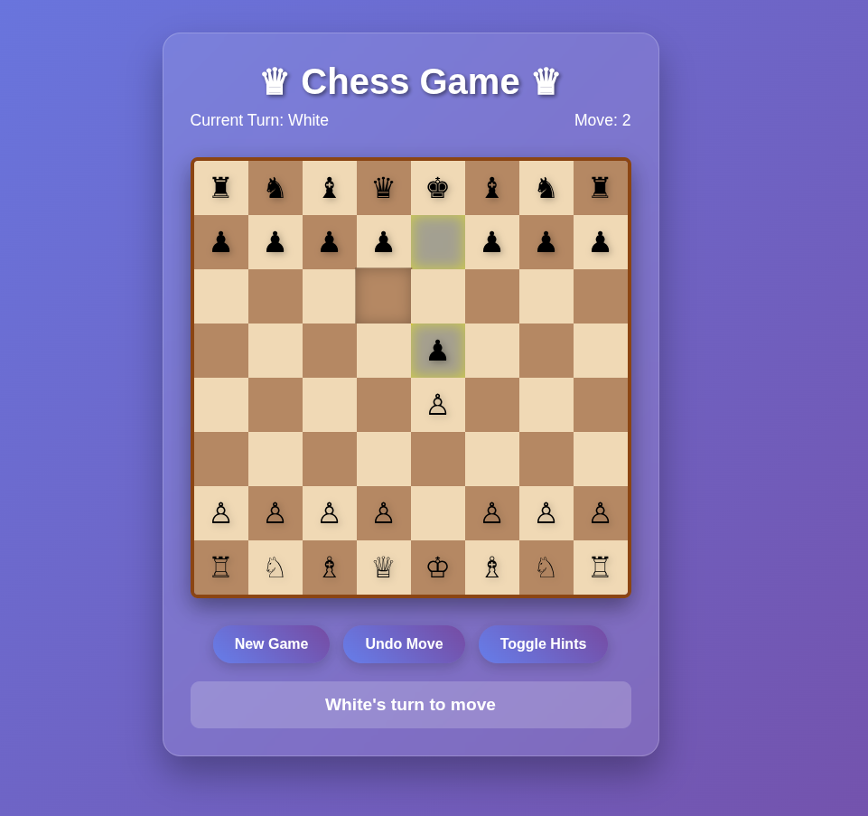

# Chess Game

An interactive web-based chess game to help you learn, play, and improve your chess skills.

## Features
- Play chess in your browser with a modern, responsive UI
- Move validation for all pieces
- Check, checkmate, and stalemate detection
- Move history and undo functionality
- Visual hints for possible moves (toggleable)
- Animated piece captures
- New game and reset options

## How to Use
1. Open `Chess.html` in your web browser.
2. Play chess by clicking on pieces and selecting valid moves.
3. Use the control buttons to start a new game, undo moves, or toggle hints.

## Project Files
- `Chess.html` — Main HTML file for the game UI
- `styles.css` — Styling for the chessboard and controls
- `chess.js` — Game logic and interactivity
- `README.md` — Project documentation

## Screenshot

---
Made with ❤️ to help you learn and enjoy chess!
